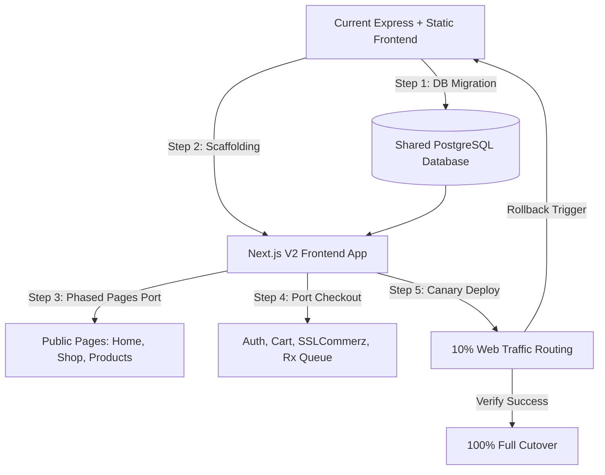

# Medicine Bazar V2 Migration Roadmap: Next.js + PostgreSQL

This document serves as the official, architectural blueprint and step-by-step roadmap for the future transition of **Medicine Bazar** from its current Node/Express + static frontend stack to a highly scalable, server-side rendered **Next.js App Router** frontend powered by a robust production-grade **PostgreSQL** database.

---

## Executive Summary
Medicine Bazar's current architecture (Node/Express + Vanilla JS/HTML/CSS + JSON/SQL Store abstraction) is exceptionally fast, hardened, and safe for its **Soft-Launch**. 

This roadmap charts the course for **V2 (Growth & Scale Phase)**, where high traffic volumes, concurrent orders, complex pharmacy operations, and intensive Search Engine Optimization (SEO) demand a unified framework capable of rendering thousands of dynamic medicine pages while maintaining instantaneous performance.



---

## 1. Why Next.js Later (The Long-Term Vision)
Moving to Next.js in the next growth cycle offers major engineering and business advantages:
*   **Server-Side Rendering (SSR) & Dynamic Hydration**: With over 2,000+ medicines, generating pages on the server (with data fetched directly from PostgreSQL) guarantees search engine crawlers receive fully populated HTML instantly, boosting ranks.
*   **Incremental Static Regeneration (ISR)**: Static product catalog pages can be revalidated and compiled in the background (e.g., every 1 hour) when stock quantities or prices change, eliminating page load lag while serving cached edge-rendered content.
*   **Edge Middleware & Performance**: Instantly performs geo-location checks, redirects, and localization directly at the CDN edge (e.g., Vercel or Cloudflare Pages), ensuring lightning-fast load times across Bangladeshi mobile networks (3G/4G/5G).
*   **Rich React Component Ecosystem**: Allows integration of modern UI libraries (e.g., Tailwind CSS, Radix UI, TanStack Query) for highly responsive checkout and prescription upload flows.

---

## 2. Why Not Now (The Soft-Launch Hardening Rationale)
Implementing Next.js during the immediate soft-launch phase is deferred for the following critical reasons:
1.  **Business Logic Hardening**: The current Node/Express system has fully operational POS sales, POS refunds, manual payments, prescription uploads, and report modules. Initiating a full rewrite now introduces substantial testing debt and software regression risks.
2.  **Mitigate Launch Complexity**: By keeping the stack simple (Node/Express backend serving compiled static pages), the deployment team has absolute control over the production environment with minimal moving parts.
3.  **Local Storage Development Fallback**: Local developers can continue operating seamlessly in JSON mode without requiring heavy database or Node server orchestration locally.
4.  **Instant Time-to-Market**: Hardening the existing working system allows Medicine Bazar to launch immediately, gather user feedback, and generate early revenue before investing capital in a complete V2 rewrite.

---

## 3. Phased Frontend Migration (Which Pages Migrate First)
To ensure uninterrupted customer operations, the frontend migration is divided into phases based on organic traffic weight and conversion impact:

### Phase A: Organic Public Pages (Priority 1)
These pages generate 85% of inbound organic traffic and have the highest SEO requirements:
1.  **Homepage**: Serves as the landing hub. Migrated first to support dynamic marketing banners, lightning-fast initial load metrics, and high-impact categories grid.
2.  **Product Detail Page**: The most critical page. Must utilize dynamic SSR routing (`/product/[id]`) to pull medicine strength, indications, generic details, and live stock from PostgreSQL instantly, ensuring search crawlers index accurate medicine schema.
3.  **Blog Page**: Utilizes Static Site Generation (SSG) to render health tips and medicine guides at compile time, achieving 100/100 Google Lighthouse performance scores.

### Phase B: Search & Shop Catalog (Priority 2)
1.  **Shop Catalog Page**: Migrated to leverage React's state management for seamless sidebar filtering (category, brand, dosage form, price range) and dynamic instant stock toggling.
2.  **Search Results Page**: Ported to utilize the newly built dynamic **Search Adapter** (Meilisearch or Algolia), combining SSR layout skeleton with fast client-side query listings.

### Phase C: Customer Operations & POS (Priority 3)
1.  **Cart & Checkout**: Migrated after public pages to secure prescription upload forms and payment verification webhooks.
2.  **Admin Dashboard & POS Module**: Admin interfaces can remain on the legacy Express panel for longer. They will be ported last, as they do not require public SEO indexing.

---

## 4. Backend API Compatibility & Parallel Run Plan
During the transitional period, the Node/Express server and the Next.js server will run in parallel, sharing a single **PostgreSQL** database:

```
                  ┌───────────────────────────────┐
                  │      Nginx Reverse Proxy      │
                  └───────────────┬───────────────┘
                                  │
         ┌────────────────────────┴────────────────────────┐
         │                                                 │
         ▼                                                 ▼
┌─────────────────┐                               ┌─────────────────┐
│ Next.js V2 Server│                               │Express V1 Server │
│ (Public Pages)  │                               │(POS & Legacy API)│
└────────┬────────┘                               └────────┬────────┘
         │                                                 │
         └────────────────────────┬────────────────────────┘
                                  ▼
                     ┌─────────────────────────┐
                     │   Shared PostgreSQL DB  │
                     └─────────────────────────┘
```

### Dynamic Routing Proxy Strategy
An **Nginx Reverse Proxy** or **Next.js rewrites** will route user traffic seamlessly between the two applications:
*   `GET /` → Next.js Homepage (V2)
*   `GET /product/:id` → Next.js Product Detail (V2)
*   `GET /api/v1/*` → Routed directly to the legacy Express Server (V1)
*   `GET /admin/pos` → Routed directly to the Express POS Panel (V1)

### State Synchronization
*   **Shared PostgreSQL State**: Both servers query and modify the same PostgreSQL database. If a cashier records a sale on the Express POS, Next.js instantly reflects the updated `stockQuantity` on the product page.
*   **Versioned APIs**: Legacy endpoints remain as `/api/v1/*`. Next.js API Routes are written under `/api/v2/*` for new features, ensuring zero disruption to existing mobile app clients or POS devices.

---

## 5. Search Engine Optimization (SEO) & Metadata Migration Plan
Maintaining Medicine Bazar's search authority is paramount. The Next.js migration will enforce:

1.  **Dynamic Metadata Generation**:
    Using Next.js `generateMetadata()` to dynamically compile SEO tags based on medicine data:
    ```typescript
    export async function generateMetadata({ params }) {
      const product = await getProduct(params.id);
      return {
        title: `${product.name} ${product.strength} - Medicine Bazar`,
        description: `Buy ${product.name} (${product.genericName}) online. ${product.indication}. Cash on delivery in Bangladesh.`,
        openGraph: {
          images: [product.imageUrl],
        }
      };
    }
    ```
2.  **Structured JSON-LD Schema Markup**:
    Automatically inject schema JSON directly into product HTML to yield Google Rich Snippets (price, stock, dosage form):
    ```json
    {
      "@context": "https://schema.org",
      "@type": "Drug",
      "name": "Napa Extend",
      "activeIngredient": "Paracetamol",
      "dosageForm": "Tablet",
      "offers": {
        "@type": "Offer",
        "price": "15.00",
        "priceCurrency": "BDT",
        "availability": "https://schema.org/InStock"
      }
    }
    ```
3.  **Strict 301 Redirection**:
    Every legacy route must map 1:1 to the new structure. Redirections are configured inside `next.config.js` to ensure zero Google PageRank loss:
    ```javascript
    redirects: async () => [
      { source: '/brand/:slug', destination: '/manufacturer/:slug', permanent: true }
    ]
    ```

---

## 6. Risk Analysis & Mitigation Matrix

| Hazard | Risk Level | Impact | Mitigation Strategy |
| :--- | :---: | :---: | :--- |
| **SEO Indexing Drop** | **High** | Loss of organic traffic | Maintain 100% URL path parity. Run Pre-launch Lighthouse and Schema validations. Implement direct 301 rewrites for altered paths. |
| **Database Schema Drift** | **Medium** | Data corruption in POS | The Next.js Prisma/Sequelize schema must mirror the Express Knex structure. All schema migrations must be executed via independent DB migration scripts, not ad-hoc framework models. |
| **Cart/Session De-synchronization** | **Medium** | checkout errors | Adopt stateless **JWT cookies** or shared Redis sessions, allowing users to seamlessly browse Next.js pages and complete checkout using the legacy API backend. |
| **Serverless Cold Starts** | **Low** | UX delays | Deploy the Next.js application to a node server (e.g. Docker container on VPS) rather than serverless functions if hosting resources in Bangladesh are network-constrained. |

---

## 7. Step-by-Step Migration Roadmap

### Milestone 1: Shared Database Initialization (Week 1)
- Activate PostgreSQL driver `DB_DRIVER=postgres` on the Express application.
- Run `node scripts/migrate-to-sql.js` to transfer all users, products, orders, and logs.
- Run tests on the Express app to verify PostgreSQL write operations.

### Milestone 2: Next.js V2 Architecture Scaffolding (Week 2)
- Initialize the Next.js App Router in `/medicine_bazar_web_v2`.
- Install core dependencies (React, Lucide icons, Vanilla CSS variables ported into Next.js styles).
- Wire database connections using Knex/Prisma pointing to the shared PostgreSQL instance.

### Milestone 3: Public Pages SSR Transition (Weeks 3-4)
- Port the Homepage and Blog layouts.
- Build dynamic `/product/[id]` detail pages with built-in JSON-LD schemas.
- Implement `/api/v2/search` suggestion endpoints using the established `BaseSearchAdapter` pattern.

### Milestone 4: Checkout & Cart Porting (Weeks 5-6)
- Integrate Cart state store.
- Re-implement prescription file-upload pipeline to secure storage directories.
- Migrate manual payment forms and connect SSLCommerz payment portals.

### Milestone 5: Shadow Launch & Canary Routing (Week 7)
- Deploy Next.js to the production network in a staging state.
- Configure Nginx to direct 10% of random web users to the Next.js public pages while routing checkout to Express API endpoints.
- Monitor error logs and search engine indexing stats closely.

### Milestone 6: Final Cutover (Week 8)
- Route 100% of user traffic to Next.js.
- Decommission the legacy Express customer-facing frontend.
- Keep the Express backend active *only* as a local POS cashier server if local hardware requirements warrant it.

---

## 8. Failure Redundancy & Rollback Strategy

To ensure zero business downtime during V2 activation, the migration incorporates an instant failover plan:

### 1. Reverse Proxy Failover (Instant Rollback)
The Nginx server acts as a circuit breaker. In the event of a critical Next.js server crash or payment gateway loop:
- The sysadmin modifies the proxy upstream pointer to redirect all dynamic paths back to the running Express app:
  ```nginx
  # Temporary Rollback Configuration
  location / {
      proxy_pass http://localhost:5050; # Fallback to hardened V1 Express Server
  }
  ```
- Traffic is restored to the working V1 system within **30 seconds**.

### 2. Database Decoupling & Read-Only Fallback
If the active PostgreSQL database experiences high locking latency during cutover:
- Express server immediately changes `DB_DRIVER=json` to fallback to local database files.
- Serves customers in read-only mode to prevent database corruption while transactions are safely logged to disk.

### 3. Continuous Database Backups
- Execute WAL (Write-Ahead Logging) archiving on PostgreSQL every 15 minutes.
- Keep hourly automated database snapshots stored in secure offline cloud buckets.
